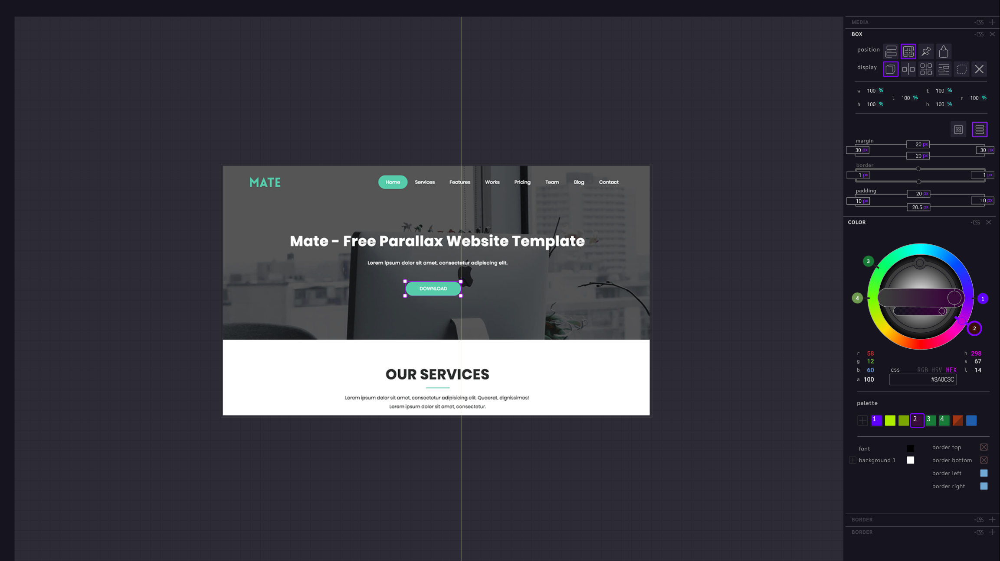

<div align=center>

# Flame
version 0.0.15

[](http://opensource.org/licenses/MIT)
[](https://github.com/CandleLibrary/flame/releases)
[](https://github.com/CandleLibrary/flame/issues)


### Wick Dev Server + Component Editor 

</div>

## A Fancy Preview 



>:warning: Preview image: current state may vary

> :warning: Currently very experimental - The editor works and breaks with gusto. Use with caution

## Features <sub><b>wip</b></sub>

- Integration with [**wick**](https://github.com/CandleLibrary/glow) to provide on-demand editing capabilities for wick components. 

  - No-Code / Drop-Into-Code CSS - HTML editing with a WYSIWYG browser editor. 

  - Animation sequencer utilizing [**glow**](https://github.com/CandleLibrary/glow). 
  
  - Integration with [**lantern**](https://github.com/CandleLibrary/lantern) allows file saving and GIT commits


# USAGE

## Install

###  yarn
```bash

$ yarn add global @candlelib/flame

```

###  npm
```bash

$ npm -g install @candlelib/flame 

```

## Dev server

Run the flame server in any folder with wick components. 

``` bash
$ cd ./my-super-secret-wick-project/
: flame
```


Flame will serve all files within the folder. It will render a folder as a webpage if that folder contains either a `index.wick` or `index.html` file. 

### Editor

To open the Flame editor, add `?flaming` to the url of the wick webpage. For example, if there is an `index.wick` page in `~/home/`, then in a browser navigate to `http://localhost:8080/home/?flaming` to open that page within the Flame editor. 
